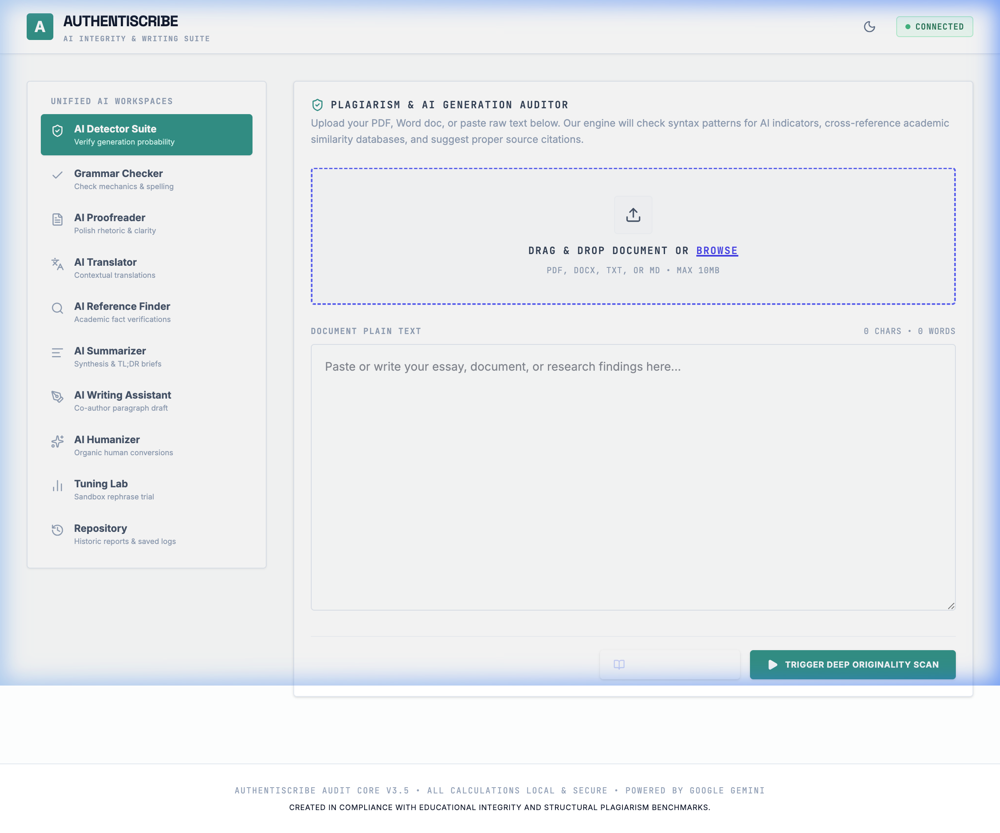
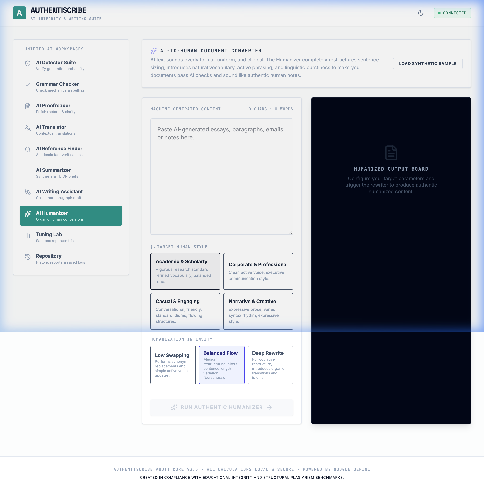
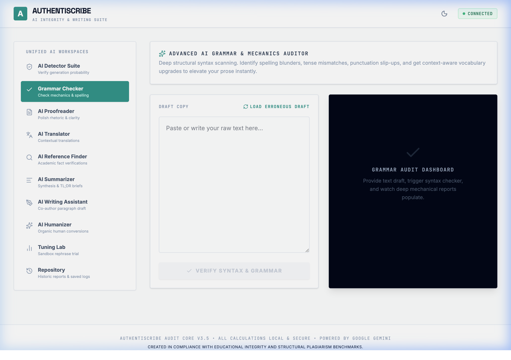
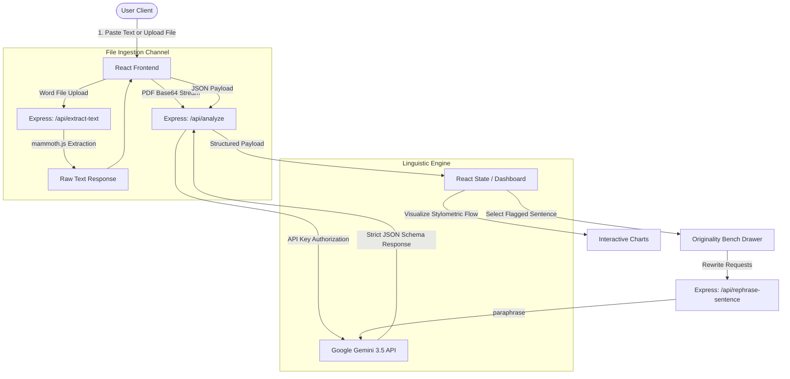

# AuthentiScribe: AI Integrity & Linguistic Intelligence Workspace

[](LICENSE)
[](https://react.dev/)
[](https://vite.dev/)
[](https://www.typescriptlang.org/)
[](https://tailwindcss.com/)
[](https://expressjs.com/)
[](https://deepmind.google/technologies/gemini/)

**AuthentiScribe** is an advanced, production-ready, full-stack linguistic intelligence workspace. Designed for educators, researchers, and professional writers, it provides a unified hub to audit document originality, analyze writing patterns, rephrase synthetically-flagged text into natural prose, and automatically format formal references and citations.

---

## Key Features

### 🔍 Plagiarism & AI Detection Suite
*   **Multi-Engine Analysis:** Audits text and documents to detect synthetic AI generation markers and plagiarism probabilities.
*   **Linguistic Integrity Charting:** Interactive, sentence-by-sentence stylometric analysis using **Recharts** to plot perplexity, burstiness, and category classification.
*   **Interactive Highlight Viewer:** Color-codes human, AI-generated, and plagiarized components in real time. Clicking flagged text opens the *Originality Bench* for targeted remediation.

### ✍️ Humanizer & Writing Module
*   **Context-Aware Rephrasing:** Preserves original semantic intent while rewriting rigid machine-generated language into fluid prose.
*   **Adjustable Profiles:** Adjust rewrite intensity (Low, Medium, High) and style presets (Academic, Business, Casual, Narrative).
*   **Interactive Suggestions:** Provides multiple humanized choices for single sentences or whole paragraphs.

### 📁 Advanced File Engineering
*   **Direct PDF Processing:** Encodes PDFs to base64 and streams them directly to the Gemini API for native textual parsing and analysis.
*   **DOCX Word Extraction:** Utilizes `mammoth.js` on the server to parse Word documents.
*   **Embedded Document Preview:** Fully interactive split-screen canvas layout to inspect uploaded PDF files locally.

### 💼 Integrated Editorial Toolkit
*   **AI Proofreader & Translator:** Structural auditing, style checks, and high-fidelity language translation.
*   **Reference Finder & Citation Assistant:** Locates academic source structures and formats statements in **APA, MLA, and Chicago** formats.
*   **History & Export Engine:** Re-inspect previous documents from a local session panel, and export cleaned documents or detailed reports.

---

## Visual Walkthrough

### 📊 Scan & Integrity Dashboard
The main dashboard visualizes readability metrics, AI generation probability, and style metrics with a real-time sentence-by-sentence color-coded breakdown.


### ✍️ AI Humanizer Workspace
Paraphrase machine-generated text using context-aware presets (Academic, Narrative, Casual) with adjustable intensities.


### 🔍 Grammar & Editorial Workbench
Detailed spelling, punctuation, and structural review tool for quick grammar fixes.


---

## Architecture & Data Flow

AuthentiScribe processes inputs through a dual-channel text/document ingestion pipeline, utilizing server-side extraction and Gemini structured JSON outputs.



---

## Technology Stack

*   **Frontend Framework:** React 18 with TypeScript and Vite
*   **Styling:** Tailwind CSS (Fluid layout transitions and adaptive dark/light color palette)
*   **Visualizations:** Recharts (Area charts for perplexity/burstiness trends)
*   **Animations:** Framer Motion (Smooth page swaps and sliding drawers)
*   **Backend Server:** Express.js + Node-TypeScript engine
*   **Integrations:** `@google/genai` (official Google developer SDK) + `mammoth` (Word doc parser)

---

## Setup & Installation

### 1. Prerequisites
Ensure you have **Node.js** (v18 or higher) and **npm** installed on your system.

### 2. Clone and Install Dependencies
Navigate to the root directory and install all node packages:
```bash
npm install
```

### 3. Environment Configuration
Create a `.env` file at the root of the project:
```env
# Google Gemini API key used for linguistic analysis
GEMINI_API_KEY=your_gemini_api_key_here

# Server Port (optional, defaults to 3000)
PORT=3000
```
> [!NOTE]
> You can acquire a Gemini API key from the [Google AI Studio Console](https://aistudio.google.com/).

### 4. Running the Development Server
Launch the full-stack development environment (which runs both the Express backend and the Vite frontend proxy on a unified runner):
```bash
npm run dev
```
Open your browser to [http://localhost:3000](http://localhost:3000).

### 5. Production Build & Start
Compile the client static bundle and boot the server in production mode:
```bash
npm run build
npm start
```

---

## Project Directory Structure

```
AUTHENTISCRIBE/
├── assets/                  # Public assets, images, and icons
├── src/
│   ├── App.tsx             # Main dashboard coordinator and tabs
│   ├── main.tsx            # App bootstrap mount
│   ├── index.css           # Global custom typography and theme colors
│   ├── types.ts            # Centralized API and interface types
│   ├── components/         # Workspace tab components
│   │   ├── ScanResultDashboard.tsx   # Integrity score gauges & Recharts visualizer
│   │   ├── OriginalityBench.tsx     # Sliding sentence remediation panel
│   │   ├── HumanizerWorkspace.tsx   # Global text recomposer presets
│   │   ├── FileUploader.tsx         # Drag & Drop file handler
│   │   ├── PDFPreview.tsx           # Inline canvas preview engine
│   │   ├── GrammarChecker.tsx       # Structural spelling and grammar engine
│   │   ├── AIProofreader.tsx        # In-depth style guide auditor
│   │   ├── AISummarizer.tsx         # Context condensator
│   │   ├── AITranslator.tsx         # Language localization module
│   │   ├── ReferenceFinder.tsx      # Source locator
│   │   ├── CitationAssistantModal.tsx # Citation compiler
│   │   ├── HistoryPanel.tsx         # Past analyses cache
│   │   └── Header.tsx               # Navigation and theme switch
│   └── utils/
│       └── helpers.ts       # Text utilities
├── server.ts               # Express application backend & Gemini integration
├── tsconfig.json           # TypeScript configuration
├── vite.config.ts          # Vite asset pipeline config
└── package.json            # Dependencies and unified runners
```

---

## License

Distributed under the **Apache-2.0** License. See `LICENSE` for more information.
